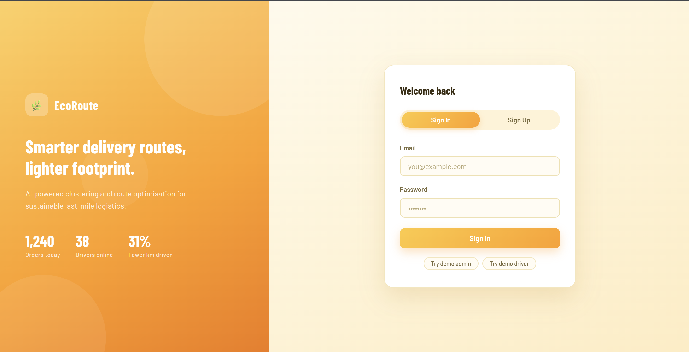
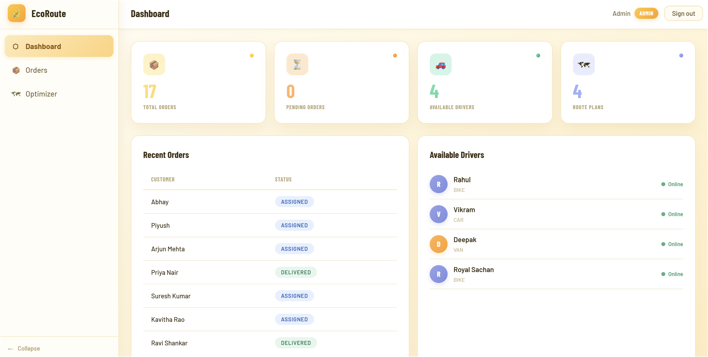
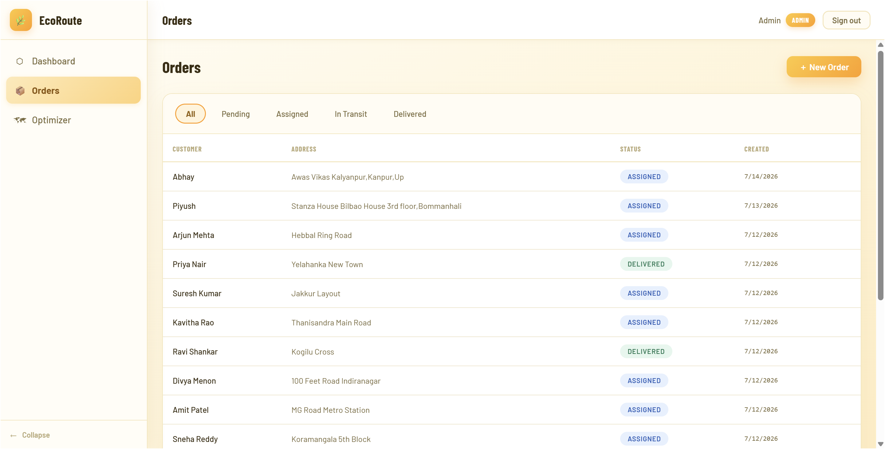
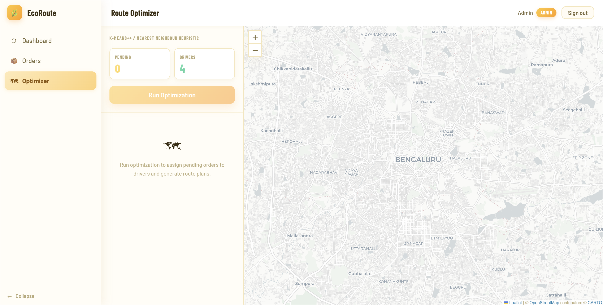
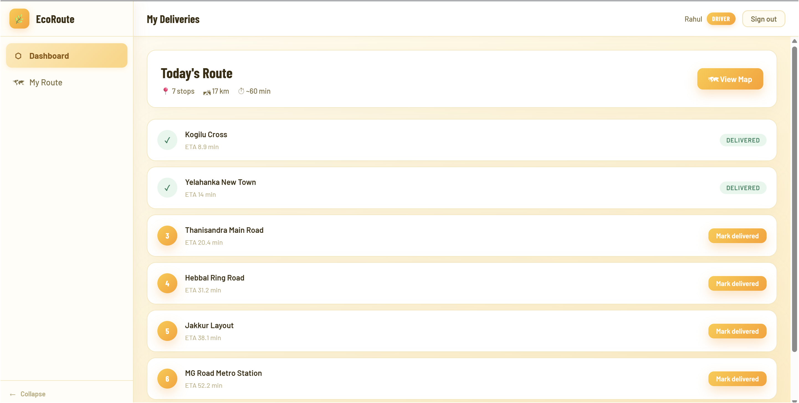
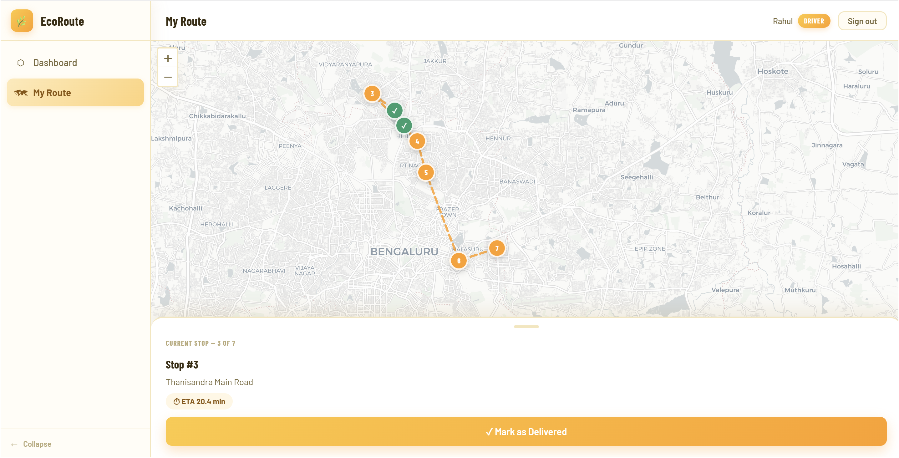

<div align="center">

# 🌿 EcoRoute

### Intelligent Delivery Route Optimizer

*Cluster orders geographically. Compute optimal driver routes. Reduce fuel and emissions.*

[](https://python.org)
[](https://fastapi.tiangolo.com)
[](https://mongodb.com)
[](https://react.dev)
[](https://vitejs.dev)
[](https://docker.com)

[](LICENSE)


</div>

---

## What is EcoRoute?

EcoRoute is a full-stack delivery management platform that solves the **last-mile delivery problem**: given scattered orders across a city and a fleet of drivers, how do you assign and sequence stops to minimize total travel distance?

It answers that with two algorithms built from scratch in pure Python:

| Stage | Algorithm | What it does |
|:---:|---|---|
| 1️⃣ | **K-Means++ Clustering** | Groups geographically close orders — one cluster per driver |
| 2️⃣ | **Nearest Neighbor TSP** | Finds an efficient visit sequence within each cluster |

No ML library wrappers. Every line of the optimization engine is explainable.

---

## Screenshots

> 📸 *Add your screenshots below by replacing the placeholder paths.*

### 🔐 Login
*Two-column layout — warm gradient hero panel left, sign-in card right.*

<!-- Replace with your screenshot -->


---

### 📊 Admin Dashboard
*Four gradient stat tiles + recent orders list + available drivers with live status dots.*

<!-- Replace with your screenshot -->


---

### 📦 Orders Management
*Scrollable filter tabs, status pills, and inline delete for pending orders.*

<!-- Replace with your screenshot -->


---

### 🗺 Route Optimizer
*Split panel — controls + route cards left, live Leaflet map right. Color-coded clusters per driver.*

<!-- Replace with your screenshot -->


---

### 🚗 Driver Dashboard
*Today's route summary + sequenced stop cards with Mark Delivered action.*

<!-- Replace with your screenshot -->


---

### 📍 Driver Route Map
*Full-screen map with numbered pins, amber route polyline, and bottom-sheet current-stop panel.*

<!-- Replace with your screenshot -->


---

## How It Works

```
┌──────────────────────────────────────────────────────────────┐
│                        React Frontend                        │
│    React Query · Zustand · React Hook Form · Leaflet.js      │
└──────────────────────────┬───────────────────────────────────┘
                           │  HTTP + JWT Bearer token
┌──────────────────────────▼───────────────────────────────────┐
│                 FastAPI  (Modular Monolith)                  │
│                                                              │
│   /auth      /orders     /drivers                            │
│   /routing              /assignments                         │
│                                                              │
│   ┌───────────────────────────────────────────────────────┐  │
│   │          Optimization Pipeline  (Pure Python)         │  │
│   │                                                       │  │
│   │   pending orders                                      │  │
│   │        │                                              │  │
│   │        ▼                                              │  │
│   │   geo.py ──► kmeans.py ──► tsp.py ──► eta.py          │  │
│   │   Haversine    K-Means++   NN-TSP    Linear ETA       │  │
│   │                                                       │  │
│   │   Zero FastAPI / Motor imports — pure computation     │  │
│   └───────────────────────────────────────────────────────┘  │
└──────────────────────────┬───────────────────────────────────┘
                           │  Motor (async driver)
┌──────────────────────────▼───────────────────────────────────┐
│              MongoDB 7  (Atlas in prod · Docker locally)     │
│     orders · drivers · users · route_plans                   │
│     2dsphere indexes on orders.location + drivers.location   │
└──────────────────────────────────────────────────────────────┘
```

### Optimization pipeline step-by-step

```
1. Fetch all PENDING orders + AVAILABLE drivers from MongoDB

2. K-Means++ initialization
   ├── Pick first centroid uniformly at random
   └── Each next centroid sampled ∝ D(x)² (spreads centroids)

3. Iterate until convergence (max shift < 0.0001 km)
   ├── Assign each order to nearest centroid (Haversine)
   └── Recompute centroid = mean(lat), mean(lng) of cluster

4. For each cluster → Nearest Neighbor TSP
   ├── Start at driver GPS location (depot)
   ├── Greedily pick nearest unvisited stop
   └── Repeat → O(n²), ~20% above optimal

5. Compute cumulative ETA per stop
   └── ETA = 5.0 + 2.0×km + 3.0×stops  (linear model)

6. Bulk-write route_plans, mark orders ASSIGNED
```

---

## Features

<details>
<summary><strong>👤 Admin</strong></summary>

- Create delivery orders with live map coordinate preview
- View all orders with filter tabs (All / Pending / Assigned / In Transit / Delivered)
- One-click **Run Optimization** across all pending orders and available drivers
- Interactive Leaflet map — color-coded cluster markers + dashed driver route polylines
- Per-driver route plan cards — distance, ETA, ordered stop list
- Delete pending orders

</details>

<details>
<summary><strong>🚗 Driver</strong></summary>

- View assigned route with sequenced stops and cumulative ETAs
- Full-screen map with numbered markers and amber route polyline
- Mark individual stops as delivered from list view or map bottom sheet
- Route auto-completes when all stops are done

</details>

<details>
<summary><strong>⚙️ System</strong></summary>

- JWT authentication with role-based access control (admin / driver)
- GeoJSON `2dsphere` indexes for efficient geospatial queries
- Async FastAPI + Motor — no blocking DB calls on the event loop
- React Query v5 — automatic caching, background refetch, zero `useEffect` data fetching
- Zustand for minimal global auth state with `localStorage` persistence
- Fully responsive — mobile sidebar becomes a slide-in drawer

</details>

---

## Tech Stack

| Layer | Technology | Reason |
|---|---|---|
| **Backend** | Python 3.11 + FastAPI | Async, fast, automatic OpenAPI/Swagger docs |
| **Database** | MongoDB 7 + GeoJSON | Native geospatial queries, flexible document schema |
| **Async Driver** | Motor 3 | Non-blocking MongoDB matching FastAPI's asyncio loop |
| **Auth** | JWT (python-jose) + bcrypt | Stateless, industry-standard, no session store |
| **ML / Optimization** | Pure Python | Every line is explainable — no black-box library calls |
| **Frontend** | React 18 + Vite | Fast HMR, modern JSX tooling |
| **Map** | Leaflet.js + React-Leaflet | Open-source, no API key required |
| **Server State** | TanStack React Query v5 | Caching, loading states, cache invalidation |
| **Global State** | Zustand | Minimal boilerplate for auth token/role |
| **HTTP Client** | Axios | Interceptors for JWT injection + 401 auto-redirect |
| **Forms** | React Hook Form | Uncontrolled inputs, performant validation |
| **Container** | Docker Compose | One-command MongoDB setup |

---

## Project Structure

```
ecoroute/
├── docker-compose.yml
│
├── backend/
│   ├── main.py                  # FastAPI app, CORS, router registration
│   ├── config.py                # Pydantic settings (reads .env)
│   ├── database.py              # Motor client, 2dsphere index creation
│   ├── seed.py                  # Creates admin + 3 drivers + 15 Bengaluru orders
│   ├── requirements.txt
│   ├── render.yaml              # Render deployment blueprint
│   ├── .python-version          # Pins Python 3.11 for Render
│   ├── .env                     # Dev defaults — change JWT_SECRET before prod
│   │
│   ├── auth/                    # JWT login, register, /me, dependencies
│   ├── orders/                  # CRUD + PENDING→ASSIGNED→IN_TRANSIT→DELIVERED FSM
│   ├── drivers/                 # List, available filter, location update
│   │
│   ├── routing/
│   │   ├── router.py            # POST /optimize  ·  GET /plans
│   │   ├── service.py           # Full optimization orchestration
│   │   ├── schemas.py
│   │   └── algorithms/          # ← Pure Python, zero app imports
│   │       ├── geo.py           # Haversine great-circle distance
│   │       ├── kmeans.py        # K-Means++ from scratch
│   │       ├── tsp.py           # Nearest Neighbor heuristic
│   │       └── eta.py           # Linear ETA model
│   │
│   └── assignments/             # Driver route fetch + stop completion
│
└── frontend/
    ├── index.html
    ├── vite.config.js
    ├── vercel.json              # SPA routing fix for Vercel
    ├── package.json
    └── src/
        ├── main.jsx             # QueryClient, BrowserRouter, root render
        ├── App.jsx              # Route definitions
        │
        ├── api/
        │   ├── axios.js         # JWT interceptor + 401 auto-logout
        │   ├── mapConfig.js     # Shared tile URL + attribution
        │   └── *.js             # One file per backend module
        │
        ├── hooks/               # React Query wrappers (useOrders, useRoutes…)
        ├── store/               # Zustand authStore (persisted to localStorage)
        │
        ├── components/
        │   ├── layout/          # Sidebar (collapse + mobile drawer), Topbar, ProtectedRoute
        │   ├── map/             # DeliveryMap (display-only), ClusterMarkers, RoutePolyline
        │   ├── orders/          # OrderTable, StatusBadge
        │   └── ui/              # Button, Input, Spinner, EmptyState
        │
        ├── pages/
        │   ├── LoginPage.jsx    # Sign In / Sign Up tabs, hero panel, quick-fill chips
        │   ├── admin/           # Dashboard, Orders, CreateOrder, RouteOptimizer
        │   └── driver/          # Dashboard (stop list), RoutePage (map + bottom sheet)
        │
        └── styles/
            ├── globals.css      # Design tokens (CSS vars), component classes, animations
            └── map.css          # Leaflet light-theme overrides
```

---

## Getting Started

### Prerequisites

| Requirement | Version |
|---|---|
| [Docker Desktop](https://www.docker.com/products/docker-desktop/) | Any recent |
| Python | 3.11 or 3.12 *(not 3.13+)* |
| Node.js | 18+ |

> ⚠️ **Python version note:** Dependencies are validated on 3.11/3.12. Python 3.13+ may fail to build native wheels (`pydantic-core`) on Windows without the full Visual C++ build tools.

---

### 1 · Clone

```bash
git clone https://github.com/mars-alien/eco-route.git
cd eco-route
```

### 2 · Start MongoDB

```bash
docker compose up -d
```

MongoDB will now **auto-start every time Docker Desktop opens** (the service has `restart: unless-stopped`).

### 3 · Backend

```bash
cd backend

# Create and activate virtual environment
py -3.11 -m venv .venv
.venv\Scripts\activate          # Windows
# source .venv/bin/activate     # macOS / Linux

# Install dependencies
pip install -r requirements.txt

# Seed demo data (1 admin + 3 drivers + 15 orders)
python seed.py

# Start the API server
python -m uvicorn main:app --reload --port 8000
```

### 4 · Frontend

```bash
cd ../frontend
npm install
npm run dev
```

### 5 · Open

| URL | What |
|---|---|
| **http://localhost:5173** | React app |
| **http://localhost:8000/docs** | Swagger UI (interactive API explorer) |
| **http://localhost:8000/redoc** | ReDoc API docs |

---

## Demo Credentials

| Role | Email | Password |
|:---:|---|---|
| 👑 Admin | `admin@ecoroute.com` | `admin123` |
| 🚗 Driver 1 | `driver1@ecoroute.com` | `driver123` |
| 🚗 Driver 2 | `driver2@ecoroute.com` | `driver123` |
| 🚗 Driver 3 | `driver3@ecoroute.com` | `driver123` |

### Quick demo walkthrough

```
1. Log in as admin
   └── Dashboard: 15 pending orders, 3 available drivers

2. Go to Optimizer → click "Run Optimization"
   └── Map: orders recolor into 3 geographic clusters
       Route cards appear with distance + ETA per driver

3. Log in as driver1
   └── My Deliveries: sequenced stops with ETAs

4. Click "Mark delivered" on each stop
   └── Badge turns green ✓
       When all done — route marked COMPLETED
```

---

## API Reference

<details>
<summary><strong>🔐 Auth</strong></summary>

| Method | Endpoint | Auth | Body / Response |
|---|---|---|---|
| `POST` | `/api/auth/login` | None | `{email, password}` → `{token, role, user_id, name}` |
| `POST` | `/api/auth/register` | None | `{name, email, password}` → creates driver account |
| `GET` | `/api/auth/me` | Any | Returns current user from token |

</details>

<details>
<summary><strong>📦 Orders</strong></summary>

| Method | Endpoint | Auth | Description |
|---|---|---|---|
| `GET` | `/api/orders` | Any | Admin: all orders · Driver: their assigned orders |
| `POST` | `/api/orders` | Admin | Create order with lat/lng coordinates |
| `GET` | `/api/orders/{id}` | Any | Single order |
| `PATCH` | `/api/orders/{id}/status` | Driver | Advance status (`IN_TRANSIT` → `DELIVERED`) |
| `DELETE` | `/api/orders/{id}` | Admin | Delete — PENDING orders only |

</details>

<details>
<summary><strong>🚗 Drivers</strong></summary>

| Method | Endpoint | Auth | Description |
|---|---|---|---|
| `GET` | `/api/drivers` | Admin | All drivers |
| `GET` | `/api/drivers/available` | Admin | Drivers with `is_available: true` |
| `PATCH` | `/api/drivers/{id}/location` | Driver | Update GPS position |

</details>

<details>
<summary><strong>🗺 Routing</strong></summary>

| Method | Endpoint | Auth | Description |
|---|---|---|---|
| `POST` | `/api/routing/optimize` | Admin | Run K-Means++ + TSP — assigns all PENDING orders |
| `GET` | `/api/routing/plans` | Admin | All route plans |
| `GET` | `/api/routing/plans/{id}` | Any | Single plan with stop list |

</details>

<details>
<summary><strong>📋 Assignments</strong></summary>

| Method | Endpoint | Auth | Description |
|---|---|---|---|
| `GET` | `/api/assignments/driver/{id}` | Any | Active route plan for a driver |
| `PATCH` | `/api/assignments/{plan_id}/stops/{idx}/complete` | Driver | Mark stop delivered |
| `GET` | `/api/assignments/all` | Admin | All active plans summary |

</details>

---

## ML Algorithms

<details>
<summary><strong>📐 Haversine Distance  <code>geo.py</code></strong></summary>

```
distance = 2R · atan2(√a, √(1−a))
  where a = sin²(Δlat/2) + cos(lat1)·cos(lat2)·sin²(Δlng/2)
```

**Why Haversine, not Euclidean?**
One degree of longitude covers ~111 km at the equator but shrinks toward the poles. Raw `(lat, lng)` coordinates are not a flat Cartesian plane — Euclidean distance is geometrically wrong for geographic clustering.

</details>

<details>
<summary><strong>🔵 K-Means++ Clustering  <code>kmeans.py</code></strong></summary>

Standard K-Means with smarter initialization that reliably avoids poor convergence:

```
Initialization (K-Means++ over naive random):
  1. Pick first centroid uniformly at random from orders
  2. For each remaining centroid k:
     - Compute D(x)² = squared Haversine to nearest chosen centroid
     - Sample next centroid with probability ∝ D(x)²
     → This spreads centroids, guaranteeing better starting positions

Iteration:
  1. Assign each order to its nearest centroid (Haversine)
  2. Recompute centroid = mean(lat), mean(lng) of assigned points
  3. Stop when max centroid shift < 0.0001 km  OR  max_iter reached
```

</details>

<details>
<summary><strong>🛣 Nearest Neighbor TSP  <code>tsp.py</code></strong></summary>

Classic greedy heuristic — fast and good enough for small clusters:

```
1. Start at driver's current GPS position (the depot)
2. Find the nearest unvisited stop (Haversine)
3. Travel there, mark visited, update current position
4. Repeat until all stops visited
```

| Property | Value |
|---|---|
| Time complexity | O(n²) per cluster |
| Solution quality | ~20% above optimal on random instances |
| Max stops per driver | 8 (configurable) |
| Production upgrade | Google OR-Tools CVRPTW with time windows |

</details>

<details>
<summary><strong>⏱ Linear ETA Model  <code>eta.py</code></strong></summary>

```
ETA (minutes) = 5.0 + 2.0 × distance_km + 3.0 × num_stops
```

| Coefficient | Value | Meaning |
|---|---|---|
| b₀ (base) | 5.0 min | App startup, first-movement overhead |
| b₁ (speed) | 2.0 min/km | 30 km/h average city speed |
| b₂ (stop) | 3.0 min/stop | Unloading + customer confirmation time |

**Production path:** train on historical delivery logs with features `time_of_day`, `day_of_week`, `vehicle_type` using `sklearn.LinearRegression`.

</details>

---

## Design Decisions

<details>
<summary><strong>Why a Modular Monolith and not Microservices?</strong></summary>

FastAPI `APIRouter` gives clean module separation (auth, orders, drivers, routing, assignments) without separate deployable services. At this scale — a handful of drivers, hundreds of orders — microservices add network hops, distributed transaction complexity, and deployment overhead for zero benefit. The package structure makes future service extraction straightforward if scale demands it.

</details>

<details>
<summary><strong>Why MongoDB over PostgreSQL + PostGIS?</strong></summary>

MongoDB has **native GeoJSON** support with `2dsphere` indexes — a proximity query is a single `$nearSphere` with no extension management. Route plan documents naturally embed their stops array, so fetching a driver's full route needs no join. Schema flexibility allows evolving order fields without migration files.

</details>

<details>
<summary><strong>Why implement the algorithms from scratch?</strong></summary>

- `sklearn.KMeans` + `OR-Tools` would solve the problem, but you can't explain what they do in a technical interview
- The K-Means++ implementation is ~80 lines; the TSP heuristic is ~30 lines
- Every coefficient, distance formula, and convergence condition is visible and changeable
- `routing/algorithms/` has **zero imports from FastAPI or Motor** — pure computation, fully unit-testable in isolation

</details>

<details>
<summary><strong>Why React Query over useEffect + useState?</strong></summary>

React Query handles loading states, error states, background refetching, cache invalidation, and deduplication automatically. `useEffect` for data fetching means manually reimplementing all of that — plus risk of race conditions and stale closure bugs on every component.

</details>

---

## Environment Variables

```env
# backend/.env
MONGO_URL=mongodb://localhost:27017
DB_NAME=ecoroute
JWT_SECRET=change-this-in-production    # ← use a long random string in prod
JWT_ALGORITHM=HS256
JWT_EXPIRE_MINUTES=1440                 # 24 hours
```

---

## Production Checklist

| Area | Current | Production Path |
|---|---|---|
| Auth storage | `localStorage` (XSS risk) | `httpOnly` cookies |
| JWT secret | Render env var ✅ | Secrets manager (AWS SSM / Vault) |
| Password hashing | bcrypt ✅ | Keep — increase cost rounds |
| ETA model | Linear formula | Train on historical logs with sklearn |
| TSP solver | Nearest neighbor | Google OR-Tools CVRPTW |
| MongoDB | Atlas M0 free tier ✅ | Replica set with oplog |
| Frontend | Vercel (CDN) ✅ | Custom domain + Vercel |
| API server | Render (single Uvicorn) ✅ | Gunicorn + multiple Uvicorn workers |
| CORS | Locked to Vercel domain ✅ | Update when domain changes |

---

## License

MIT — see [LICENSE](LICENSE) for details.

---

<div align="center">

Built with 🌿 to make delivery routing smarter and greener.

</div>
